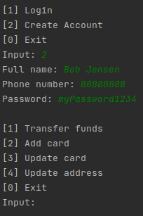
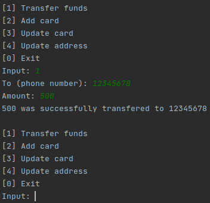

# Mobile Qway

---

## Description
This application simulates monetary transfers between users.

## Installation
Make sure to have the latest [JDK](https://www.oracle.com/java/technologies/javase/jdk15-archive-downloads.html) installed on you device.

## Usage



### Query Examples
Create tables:
```sqlite
create table addresses (
    phone_number TEXT not null constraint addresses_pk primary key,
    street      TEXT    not null,
    city        TEXT    not null,
    postal_code TEXT    not null
);

create table transactions (
    datetime TEXT constraint transactions_pk primary key,
    from_phone  TEXT not null,
    to_phone TEXT not null,
    amount         REAL    not null
);

create table users (
    phone_number TEXT not null constraint users_pk primary key,
    name              TEXT    not null,
    registration_date TEXT    not null
);

create table credentials (
    phone_number TEXT not null constraint credentials_pk primary key,
    salt              TEXT    not null,
    hash              TEXT    not null
);

create table cards (
    phone_number TEXT not null constraint cards_pk primary key,
    card_number    TEXT       not null,
    active         BOOLEAN    not null
);
```
List users:
```sqlite
SELECT * FROM users;
```
List transfers:
```sqlite
SELECT * FROM transfers;
```

## Contributions
Pull requests are welcome. For major changes, please open an issue first to discuss what you would like to change.

## Resources
[Password regex](https://stackoverflow.com/questions/19605150/regex-for-password-must-contain-at-least-eight-characters-at-least-one-number-a)

## License
[MIT](https://choosealicense.com/licenses/mit/)